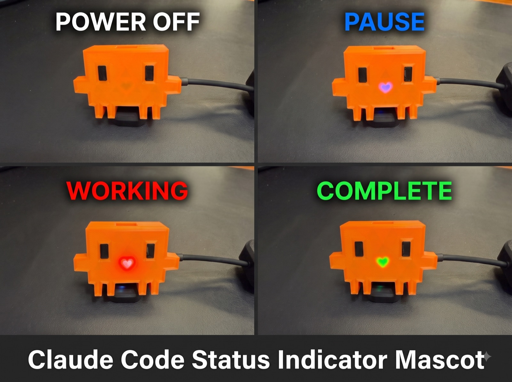
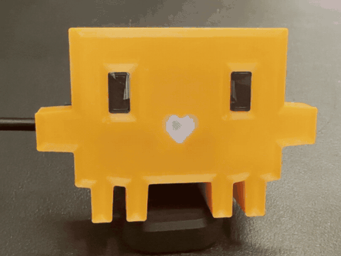

# Clawd Heartbeat

*[日本語版はこちら / Japanese version](README.ja.md)*

A physical status indicator for [Claude Code](https://claude.com/claude-code), driven by a single LED on an M5Atom Lite. Even when you're not looking at the terminal, you can tell at a glance — from the corner of your eye — whether Claude is **working**, **blocked waiting for your approval**, or **done**.

**No electronics skills needed.** No soldering, no wiring — the only electronic part is a single off-the-shelf M5Atom Lite (under $15 / ¥2,000). Buy it, flash it, drop it in the printed shell.

Put it inside a 3D-printed Clawd figure with a dead-front heart window, and you get a desk companion whose heart beats while Claude works and pounds red when it needs you.



```
Claude Code hooks ──HTTP GET (WiFi)──────┐
                    line command (USB)───┼──> M5Atom Lite ──> FastLED ──> SK6812
                    line command (BLE)───┘
```

Three transports, same one-line protocol. **WiFi**: the hook sends an HTTP GET — pick it when the Atom can share a network with the Mac. **USB serial**: the hook writes a line to the serial port — pick it when they can't share a network (guest WiFi with client isolation, corporate 802.1X, no DHCP reservations) and the Atom is plugged into the Mac. **BLE**: a small resident daemon on the Mac holds a Bluetooth Low Energy connection and forwards the lines — pick it to keep the Atom wireless (USB power only) where WiFi won't work. BLE lives on the `bluetooth-spp` branch; `main` ships WiFi + USB serial.

Why not Bluetooth Classic (SPP)? macOS drops an idle SPP serial link even with the port held open and needs ~2 s to reconnect on every send, so it can't back a status light. BLE keeps the connection open, so sends land in tens of milliseconds. See docs/NOTES.md.

Supplementary docs (currently in Japanese):

- [`LIFECYCLE.md`](docs/LIFECYCLE.md) — how Claude Code's hook events map to LED states, including the blind spots (why the LED stays red after you hit Yes, etc.)
- [`NOTES.md`](docs/NOTES.md) — design decision log and empirically measured hook behavior that the official docs don't cover
- [`HANDOFF.md`](docs/HANDOFF.md) — original design rationale and rejected alternatives (including why naive serial resets the Atom Lite — the USB transport works around that, see NOTES.md)
- [`ANTIGRAVITY.md`](docs/ANTIGRAVITY.md) — drive the same LED from Google Antigravity's hooks (shares the BLE daemon; can show the approval-wait red)

## LED states

| State | Appearance | Trigger (hook) |
| :--- | :--- | :--- |
| `idle` | Blue, steady (1/2 brightness) | SessionStart / SessionEnd |
| `tool` | White breathing (1.5 s cycle) — **reads as pink** through an orange case | UserPromptSubmit / PreToolUse / PostToolUse |
| `wait` | Red 400 ms blink for 30 s, then steady red (idle after 10 min) | PermissionRequest / AskUserQuestion dialog (detected in led.sh) |
| `done` | Green 150 ms blink for 6 s | Stop |
| `err` | Red fast blink (120 ms) | StopFailure |
| rainbow | Rainbow swirl for 10 s, then back to the current state | Pressing the front button (the LED face) |
| off | Auto-off 30 min after the last request; any request wakes it | — |
| idle, slow blue blink | Link down: BLE is enabled but the Mac isn't connected (Bluetooth off, daemon stopped, or not yet linked) | — |



*Idle → working → **waiting for your approval** → back to work → done. (Recorded with `./led-demo.sh clip`.)*

Note on the pink heart: `tool` drives the LED white, but orange PLA absorbs green strongly, so what comes through the heart window is red + blue — a pink/magenta glow. It's a happy accident we kept. With a different filament color, expect a different shade (the `led-tuning` skill helps you re-pick colors).

**Multi-session support**: the firmware tracks state per session (up to 8) and aggregates with priority `wait > err > done > tool > idle`. If any session is waiting for approval, the LED blinks red no matter what the others are doing. Sessions expire after 10 minutes without updates.

## Hardware

- M5Atom Lite (ESP32-PICO-D4), onboard SK6812 × 1 (GPIO27)
- USB Type-C, always powered
- No additional components

## Setup

### The easy way: let Claude Code do it

This repo ships with a `CLAUDE.md` and two skills. Clone it, open Claude Code inside, and just say:

> **"set this up"** — walks you through choosing a transport (WiFi or USB serial), flashing, addressing the device, and hook installation, verifying each step
>
> **"the green looks dim through my case"** (or any color/brightness complaint) — the `led-tuning` skill measures translucency with your actual filament and adjusts colors iteratively

The manual steps below are the same procedure, if you prefer doing it yourself.

### 1. Build and flash

Requirement: [PlatformIO Core CLI](https://platformio.org/) (`brew install platformio`)

```bash
cp include/secrets.h.example include/secrets.h   # fill in your WiFi SSID/password (2.4 GHz only), or leave the SSID empty for USB-serial-only
pio run -t upload
```

If the board won't enter download mode, hold the button (the LED face itself) while plugging in USB.

**WiFi transport**: on first boot, read the IP and MAC from serial, then give the device a fixed IP via your router's DHCP reservation:

```bash
pio device monitor   # prints "ready: http://<IP>" and "mac: <MAC>"
```

**USB serial transport**: no IP needed. Find the port with `ls /dev/cu.usbserial-*` (the name is derived from the chip's serial number, so it stays stable across replugs) and check the link:

```bash
echo /dev/cu.usbserial-XXXXXXXX > .atom-ip   # gitignored; led-test.sh / led-demo.sh read it
./led-test.sh status                          # should print state=idle ...
```

WiFi is optional: with an empty SSID the firmware skips WiFi entirely (no purple boot phase). With an SSID set, both transports work at once and a WiFi outage no longer reboots the device.

**BLE transport** (branch `bluetooth-spp`): the firmware advertises as a BLE peripheral, and a resident Mac-side daemon holds the connection and forwards command lines. It needs [uv](https://docs.astral.sh/uv/) (or `pip install bleak`) and, on first run, macOS Bluetooth permission.

```bash
uv run ble-bridge.py            # scans, connects, holds the link; grant the Bluetooth prompt once
ATOM=ble ./led-test.sh status   # should print state=... ble=connected
```

Point the hook at BLE by setting `ATOM_BLE="1"` at the top of `~/.claude/led.sh` (leave `ATOM_SERIAL` empty). Add `led.sh ensure-ble` to the SessionStart hook so the daemon (and its BLE connection) is up before the first event; led.sh also autostarts it on demand via `uv run --script` as a fallback:

```json
"SessionStart": [{ "hooks": [
  { "type": "command", "command": "$HOME/.claude/led.sh ensure-ble", "async": true },
  { "type": "command", "command": "$HOME/.claude/led.sh idle", "async": true }
] }]
```

Requires the 3 MB app partition, already set in `platformio.ini`.

`platform = espressif32@6.9.0` is pinned on purpose — do not bump it casually (see docs/NOTES.md).

### 2. Hook setup

Copy [`led.sh`](led.sh) to `~/.claude/led.sh` and set the transport at the top: `ATOM_SERIAL` (USB port path) for serial, or leave it empty and set `ATOM_URL` for WiFi:

```bash
cp led.sh ~/.claude/led.sh && chmod +x ~/.claude/led.sh
```

led.sh is more than a send wrapper (details in docs/NOTES.md):

- Extracts `session_id` from the hook JSON on stdin and reports state per session
- Converts AskUserQuestion (choice dialog) display into `wait`
- While a dialog is awaiting your answer, keeps a marker file so that tool events
  from subagents (which share the parent's session_id) can't overwrite the red —
  only the completion of the awaited tool call clears it
- While a dialog is open, tails the session transcript to catch denials and
  Ctrl+C interrupts (which fire no hook event) and clears the red within seconds
- Attaches a millisecond send timestamp so the device can drop out-of-order
  updates from async hooks
- Over USB, opens the port with `-hupcl` so the DTR/RTS lines never toggle —
  otherwise every hook would reset the board (the reason serial was originally rejected)

Merge the following into `hooks` in `~/.claude/settings.json` (`"async": true` on every event is required):

```json
{
  "hooks": {
    "SessionStart":      [{ "hooks": [{ "type": "command", "command": "$HOME/.claude/led.sh idle", "async": true }] }],
    "UserPromptSubmit":  [{ "hooks": [{ "type": "command", "command": "$HOME/.claude/led.sh tool", "async": true }] }],
    "PreToolUse":        [{ "matcher": "*", "hooks": [{ "type": "command", "command": "$HOME/.claude/led.sh tool", "async": true }] }],
    "PostToolUse":       [{ "matcher": "*", "hooks": [{ "type": "command", "command": "$HOME/.claude/led.sh tool", "async": true }] }],
    "PostToolUseFailure": [{ "matcher": "*", "hooks": [{ "type": "command", "command": "$HOME/.claude/led.sh tool", "async": true }] }],
    "PermissionRequest": [{ "matcher": "*", "hooks": [{ "type": "command", "command": "$HOME/.claude/led.sh wait", "async": true }] }],
    "PermissionDenied":  [{ "matcher": "*", "hooks": [{ "type": "command", "command": "$HOME/.claude/led.sh idle", "async": true }] }],
    "Stop":              [{ "hooks": [{ "type": "command", "command": "$HOME/.claude/led.sh done", "async": true }] }],
    "StopFailure":       [{ "hooks": [{ "type": "command", "command": "$HOME/.claude/led.sh err", "async": true }] }],
    "SessionEnd":        [{ "hooks": [{ "type": "command", "command": "$HOME/.claude/led.sh idle", "async": true }] }]
  }
}
```

Restart Claude Code and confirm the hooks are loaded with `/hooks`.

## FAQ — known behaviors (detected, but nothing we can do)

Claude Code's hooks do not report dialog *answers* or *interruptions*, so the following are accepted as-is. See [LIFECYCLE.md](docs/LIFECYCLE.md) for the full picture.

**Q. I approved (Yes) but it's still red**
No event fires at the moment of approval. The next signal is the *completion* of the approved command, so the red lasts exactly as long as the command runs. Approve a long build and it stays red the whole time. Rule of thumb: blinking red = probably unanswered (first 30 s), steady red = probably answered and a long command is running.

**Q. I denied (No) / hit Ctrl+C, but it's still red**
Denial and interruption fire no hook event at all (verified empirically with a logger on every event). To compensate, led.sh watches the session transcript while a dialog is open and clears the red within a few seconds of a denial or interrupt (best effort — it string-matches transcript entries). Fallbacks if that misses: your next prompt clears it instantly, and it drops to idle after 10 minutes.

**Q. It keeps breathing white after the turn should be over**
Another concurrently open Claude Code session is probably working — the display aggregates all sessions. Run `./led-test.sh status` to see which session holds which state. Leftover manual test sends expire after 2 minutes.

**Q. Nothing is lit**
It auto-offs 30 minutes after the last event. Not a failure — any event wakes it.

**Q. It's purple right after boot**
That's the WiFi-connecting indicator. If it stays purple, check that your SSID is 2.4 GHz.

## Device API (HTTP and serial)

The same three commands are available over both transports. Serial commands are one line each at 115200 baud, terminated by a newline; the device answers with one line (`ok` / `stale` / `unknown state`), and `status` answers with the report followed by an empty line.

| HTTP | Serial | Description |
| :--- | :--- | :--- |
| `GET /led?s=<state>&sid=<id>&ts=<ms>` | `led s=<state> sid=<id> ts=<ms>` | Report state. `state` is idle/tool/wait/done/err; `sid` is a session ID (default: `default`). Updates older than the last applied `ts` are rejected (omit `ts` to always apply) |
| `GET /rgb?r=&g=&b=` | `rgb r= g= b=` | Light an arbitrary color directly (for testing; returns to normal on the next `led` or after 10 min) |
| `GET /` | `status` | Aggregated state, session count/breakdown, uptime, RSSI, WiFi status (`off` / `connecting` / IP) |

## LED testing

```bash
./led-test.sh coupon        # translucency test for case material (interactive; run in a real terminal)
./led-test.sh states        # replay the 5 states in order
./led-test.sh rgb 0 255 0   # light an arbitrary color
./led-test.sh ramp 0 255 0  # ramp a color through 8 brightness steps
./led-test.sh status        # check device state
./led-test.sh off           # back to idle
```

For filming or a quick visual check, `led-demo.sh` plays the animations automatically — no keypresses, so you can start recording and let it run:

```bash
./led-demo.sh                  # all five states in sequence
./led-demo.sh clip             # 16 s sequence tuned for video/GIF (easiest to film)
./led-demo.sh story            # realistic flow: working → permission → approved → done
./led-demo.sh wait-full        # shows the wait blink → steady transition at 30 s
./led-demo.sh states --solo    # silence other sessions so playback isn't overridden
./led-demo.sh states --loop --lead 10   # repeat, with a 10 s head start
```

Tip: `led-test.sh rgb R G B` holds a fixed color for 10 minutes, which makes still photography much easier than chasing a blink.

The device address comes from the `ATOM` environment variable or a gitignored `.atom-ip` file next to the script — either an HTTP URL (`http://192.168.1.50`) or a serial port path (`/dev/cu.usbserial-XXXX`); the scripts pick the transport from the prefix.

## Troubleshooting

| Symptom | Fix |
| :--- | :--- |
| LED stays purple | WiFi not connected. Make sure the SSID is 2.4 GHz (5 GHz unsupported). Purple gives up after 20 s; over USB serial the first command ends it immediately |
| Hooks don't reach the device over WiFi | Guest/corporate WiFi often blocks device-to-device traffic (client isolation). Switch to the USB serial or BLE transport |
| BLE device not found when scanning | Make sure the firmware splits advertising (UUID in adv, name in scan response) and that macOS granted Bluetooth permission to the terminal/uv. `uv run ble-bridge.py --scan` lists what's visible |
| Device reboots when a hook fires (USB) | Something opened the port without `-hupcl` (e.g. a serial monitor). Close it; led.sh's own writes don't toggle DTR/RTS |
| Won't enter download mode | Hold the button while plugging in USB |
| No red on permission prompts | Check `/hooks` shows PermissionRequest loaded |
| Claude Code feels slow | Verify `async: true` on hooks (and `-m 1` on curl for the WiFi transport) |
| `pio device monitor` fails | It needs a TTY and can't run in the background; use the pyserial recipe in docs/NOTES.md |

## Case

The case is a pixel-art Clawd figure with a dead-front heart window: a 0.4 mm orange PLA skin printed as part of the body, with an 8–10 mm air gap to the LED. All state colors — including the dim idle blue — read through it. The eyes are printed separately (no AMS needed), the belly and back halves are held together by four 6 mm × 3 mm disc magnets (no screws/glue, opens for reflashing), and cable notches on all four sides let you route USB-C in any direction. STL: [MakerWorld](https://makerworld.com/ja/models/3159586-clawd-heartbeat).

## License & disclaimer

Code is [MIT licensed](LICENSE). This is an **unofficial fan project** — not affiliated with, endorsed by, or sponsored by Anthropic. "Claude", "Claude Code", and the Clawd character belong to Anthropic.
